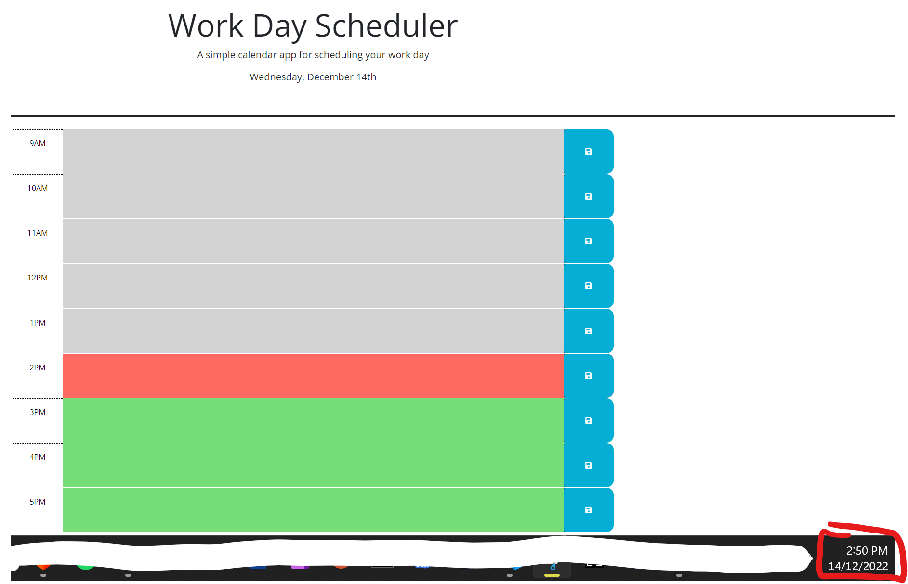

Work Day Scheduler
A work day scheduler which can be used as a live, updating to-do list!

Description
This project is a work scheduler. It shows timeslots from 9am-5pm built from bootstrap objects. The timeslots change colour based on whether they are before, during or after the current time. It also shows a live date at the top of the page.

If a timeslot is before the current time, it will turn grey to indicate it is in the past. If a timeslot is coincidental with the current time, it will turn red. If the current time is before a timeslot, the timeslot will turn green to indicate it is in the future.

Users can input data into the timeslots and the data will be saved into localStorage.

This project served as an opportunity to work with local storage, bootstrap, dayJS and logic.

Installation
The project can be accessed at: https://niktern.github.io/Work-Day-Scheduler/Develop/

Usage
Input text into a timeslot by clicking on it. This text can be saved by clicking the save icon on the right hand sight of that given timeslot. The date and colour of the timeslots will automatically update every second.

Screenshot of website:

License
MIT License

Copyright (c) [2022] [NikolasTernezis]

Permission is hereby granted, free of charge, to any person obtaining a copy of this software and associated documentation files (the "Software"), to deal in the Software without restriction, including without limitation the rights to use, copy, modify, merge, publish, distribute, sublicense, and/or sell copies of the Software, and to permit persons to whom the Software is furnished to do so, subject to the following conditions:

The above copyright notice and this permission notice shall be included in all copies or substantial portions of the Software.

THE SOFTWARE IS PROVIDED "AS IS", WITHOUT WARRANTY OF ANY KIND, EXPRESS OR IMPLIED, INCLUDING BUT NOT LIMITED TO THE WARRANTIES OF MERCHANTABILITY, FITNESS FOR A PARTICULAR PURPOSE AND NONINFRINGEMENT. IN NO EVENT SHALL THE AUTHORS OR COPYRIGHT HOLDERS BE LIABLE FOR ANY CLAIM, DAMAGES OR OTHER LIABILITY, WHETHER IN AN ACTION OF CONTRACT, TORT OR OTHERWISE, ARISING FROM, OUT OF OR IN CONNECTION WITH THE SOFTWARE OR THE USE OR OTHER DEALINGS IN THE SOFTWARE.